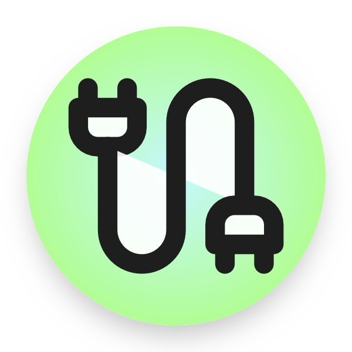

<!-- Improved compatibility of back to top link: See: https://github.com/othneildrew/Best-README-Template/pull/73 -->
<a id="readme-top"></a>
<!--
*** Thanks for checking out the Best-README-Template. If you have a suggestion
*** that would make this better, please fork the repo and create a pull request
*** or simply open an issue with the tag "enhancement".
*** Don't forget to give the project a star!
*** Thanks again! Now go create something AMAZING! :D
-->


<!-- PROJECT SHIELDS -->
<!--
*** I'm using markdown "reference style" links for readability.
*** Reference links are enclosed in brackets [ ] instead of parentheses ( ).
*** See the bottom of this document for the declaration of the reference variables
*** for contributors-url, forks-url, etc. This is an optional, concise syntax you may use.
*** https://www.markdownguide.org/basic-syntax/#reference-style-links
-->
[![Contributors][contributors-shield]][contributors-url]
[![Forks][forks-shield]][forks-url]
[![Stargazers][stars-shield]][stars-url]
[![Issues][issues-shield]][issues-url]
[![project_license][license-shield]][license-url]
[![LinkedIn][linkedin-shield]][linkedin-url]


<!-- PROJECT LOGO -->
<br />
<div align="center">
  <a href="https://github.com/srivp365/discord-crm/tree/main">
    
  </a>

<h3 align="center">Discord-CRM</h3>

  <p align="center">
    Messaged based CRM, for keeping in touch with your peeps 🤝
    <br />
    <a href="https://github.com/srivp365/discord-crm"><strong>Explore the docs »</strong></a>
    <br />
    <br />
    <a href="https://github.com/srivp365/discord-crm">View Demo</a>
    &middot;
  </p>
</div>


<!-- TABLE OF CONTENTS -->
<details>
  <summary>Table of Contents</summary>
  <ol>
    <li>
      <a href="#about-the-project">About The Project</a>
      <ul>
        <li><a href="#built-with">Built With</a></li>
      </ul>
    </li>
    <li>
      <a href="#getting-started">Getting Started</a>
      <ul>
        <li><a href="#prerequisites">Prerequisites</a></li>
        <li><a href="#installation">Installation</a></li>
      </ul>
    </li>
    <li><a href="#usage">Usage</a></li>
    <li><a href="#roadmap">Roadmap</a></li>
    <li><a href="#contributing">Contributing</a></li>
    <li><a href="#license">License</a></li>
    <li><a href="#contact">Contact</a></li>
    <li><a href="#acknowledgments">Acknowledgments</a></li>
  </ol>
</details>


<!-- ABOUT THE PROJECT -->
## About The Project

[![Product Name Screen Shot][product-screenshot]](https://example.com)

<p align="right">(<a href="#readme-top">back to top</a>)</p>


### Built With

* [![Discord][Discord]][Discord]
* [![Python][Python]][Python]


<p align="right">(<a href="#readme-top">back to top</a>)</p>


<!-- GETTING STARTED -->
## Getting Started

The bot is available on the marketplace!, you can check it out there if you'd like. (Will update the url eventually). Otherwise, I've outlined below the steps to get run it locally!

### Prerequisites
Have Python and Pycord installed for development, and uv for virtual environment creation and package management (should you like, local dev using venv and pip works as well).


### Installation

1. Get a free API Key at [https://example.com](https://example.com)
2. Clone the repo
   ```sh
   git clone https://github.com/srivp365/discord-crm.git
   ```
3. Install the required packages
   ```sh
   uv sync
   ```
4. Create a .env file and add your TURSO DB auth token and url, alongside your discord bot token.
   ```sh
   TURSO_DATABASE_URL= 
   TURSO_AUTH_TOKEN=
   TOKEN=
   ```
5. Add the following channel ids to your env as well. (Forum channel keeps track of people using forum threads/posts)
   ```sh
   USER_ID=
   BIRTHDAYS_CHANNEL=
   DEBRIEF_CHANNEL=
   FORUM_CHANNEL=

   ```

<p align="right">(<a href="#readme-top">back to top</a>)</p>


<!-- USAGE EXAMPLES -->
## Usage

The bot comes with  a few basic commands as demonstrated below. 

### **General Commands (can be executed anywhere)**

#### Add person


Used too add a person (as a post) to the forum channel.


    
Upon completion, the bot responds with the person created (linked to the post) alongside the next scheduled date for contact. 


Success state!

### **People specific commands (can only be executed in the thread of a specific person)**

#### Update your latest interaction

Used to tell the bot how your latest interaction went, so it can dynamically schedule when the next best time to chat with them would be.


Based on this, it will schedule your next interaction!

> Your choice updates interval/gap to next contact by n% from the default tier you chose during creation.
> Great = shrink by 20%
> Neutral = stays the same
> Flat = increases duration by 30%, *unless flat streak hits 3, at which point person is demoted to a tier below their current one*. 


<p align="right">(<a href="#readme-top">back to top</a>)</p>

#### Add note

Adds a note to a user.


Success state!


<!-- ROADMAP -->
## Roadmap

- [ ] Add additional note functionality (to make notes more useful)
- [ ] Fix the db row reads on the birthdays column, since using strftime forces the db to read every row and run the conversion instead of just fetching the rows we need.
- [ ] Add a nicer response body from the bot when responding to slash commands + timed briefs

See the [open issues](https://github.com/srivp365/discord-crm/issues) for a full list of proposed features (and known issues).

<p align="right">(<a href="#readme-top">back to top</a>)</p>


<!-- CONTRIBUTING -->
## Contributing

Contributions are what make the open source community such an amazing place to learn, inspire, and create. Any contributions you make are **greatly appreciated**.

If you have a suggestion that would make this better, please fork the repo and create a pull request. You can also simply open an issue with the tag "enhancement".
Don't forget to give the project a star! Thanks again!

1. Fork the Project
2. Create your Feature Branch (`git checkout -b feature/AmazingFeature`)
3. Commit your Changes (`git commit -m 'Add some AmazingFeature'`)
4. Push to the Branch (`git push origin feature/AmazingFeature`)
5. Open a Pull Request

<p align="right">(<a href="#readme-top">back to top</a>)</p>

### Top contributors:

<a href="https://github.com/srivp365/discord-crm/graphs/contributors">
  
</a>


<!-- LICENSE -->
## License

Distributed under the project_license. See `LICENSE.txt` for more information.

<p align="right">(<a href="#readme-top">back to top</a>)</p>


<!-- CONTACT -->
## Contact

Srivathsan Prasanna - srivdev365@gmail.com

Project Link: [https://github.com/srivp365/discord-crm](https://github.com/srivp365/discord-crm)

<p align="right">(<a href="#readme-top">back to top</a>)</p>


<!-- ACKNOWLEDGMENTS -->
## Acknowledgments

* None as of yet!

<p align="right">(<a href="#readme-top">back to top</a>)</p>


<!-- MARKDOWN LINKS & IMAGES -->
<!-- https://www.markdownguide.org/basic-syntax/#reference-style-links -->
[contributors-shield]: https://img.shields.io/github/contributors/srivp365/discord-crm.svg?style=for-the-badge
[contributors-url]: https://github.com/srivp365/discord-crm/graphs/contributors
[forks-shield]: https://img.shields.io/github/forks/srivp365/discord-crm.svg?style=for-the-badge
[forks-url]: https://github.com/srivp365/discord-crm/network/members
[stars-shield]: https://img.shields.io/github/stars/srivp365/discord-crm.svg?style=for-the-badge
[stars-url]: https://github.com/srivp365/discord-crm/stargazers
[issues-shield]: https://img.shields.io/github/issues/srivp365/discord-crm.svg?style=for-the-badge
[issues-url]: https://github.com/srivp365/discord-crm/issues
[license-shield]: https://img.shields.io/github/license/srivp365/discord-crm.svg?style=for-the-badge
[license-url]: https://github.com/srivp365/discord-crm/blob/master/LICENSE.txt
[linkedin-shield]: https://img.shields.io/badge/-LinkedIn-black.svg?style=for-the-badge&logo=linkedin&colorB=555
[linkedin-url]: https://linkedin.com/in/srivp/
[product-screenshot]: images/screenshot.png

<!-- Shields.io badges. You can a comprehensive list with many more badges at: https://github.com/inttter/md-badges -->
[Next.js]: https://img.shields.io/badge/next.js-000000?style=for-the-badge&logo=nextdotjs&logoColor=white
[Next-url]: https://nextjs.org/
[React.js]: https://img.shields.io/badge/React-20232A?style=for-the-badge&logo=react&logoColor=61DAFB
[React-url]: https://reactjs.org/
[Vue.js]: https://img.shields.io/badge/Vue.js-35495E?style=for-the-badge&logo=vuedotjs&logoColor=4FC08D
[Vue-url]: https://vuejs.org/
[Angular.io]: https://img.shields.io/badge/Angular-DD0031?style=for-the-badge&logo=angular&logoColor=white
[Angular-url]: https://angular.io/
[Svelte.dev]: https://img.shields.io/badge/Svelte-4A4A55?style=for-the-badge&logo=svelte&logoColor=FF3E00
[Svelte-url]: https://svelte.dev/
[Laravel.com]: https://img.shields.io/badge/Laravel-FF2D20?style=for-the-badge&logo=laravel&logoColor=white
[Laravel-url]: https://laravel.com
[Bootstrap.com]: https://img.shields.io/badge/Bootstrap-563D7C?style=for-the-badge&logo=bootstrap&logoColor=white
[Bootstrap-url]: https://getbootstrap.com
[JQuery.com]: https://img.shields.io/badge/jQuery-0769AD?style=for-the-badge&logo=jquery&logoColor=white
[JQuery-url]: https://jquery.com
[Discord]: https://img.shields.io/badge/Discord-%235865F2.svg?&logo=discord&logoColor=white
[Python]: https://img.shields.io/badge/Python-3776AB?logo=python&logoColor=fff
